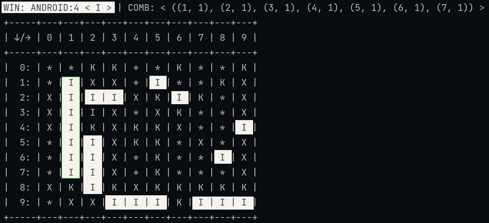
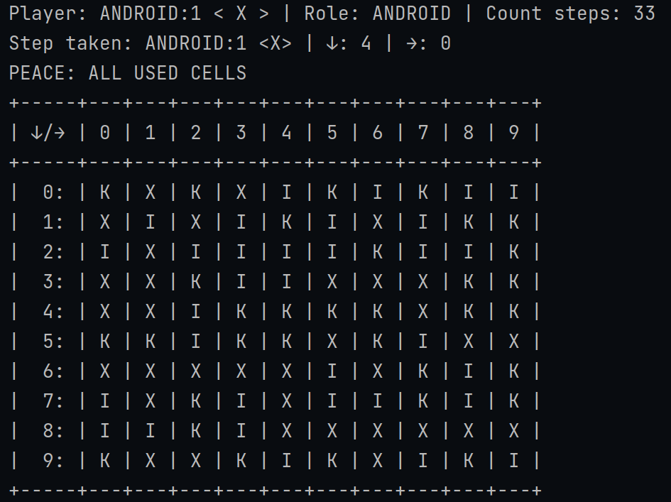

# XO Tic-Tac-Toe

## Основні можливості:
+ **Можливо додати скільки завгодно гравців**

+ **Можливо створити ігрову таблицю любого розміру**:  
+ + *Задавши параметри **рядка**, **стовбця** і **розмір виграшної комбінації***

+ **"Штучний інтелект" не повторює себе і працює по різним сценаріям**

+ *Додавайте свій функціонал успадковуючись від потрібних класів*


## Знайомство з біблеотекою
### Старт швидкої гри в консолі
В нас є можливість створити ігрову таблицю любого розміру і з будь-якою кількістю гравців.  
В якій параметри штучного інтелекту і перевірки виграшної комбінації для гравців підлаштуються автоматично  
Скористаємося цим. **Тому замість класичної таблиці 3х3 - створимо 6х6 на 3 гравця**  
_В цей раз хай грають боти один з одним. Поглянемо на це_

```python
from game import TableParam, TableDefault, GameConsole, Player, Players, Symbol

if __name__ == "__main__":
    p1 = Player(name="Pertos_ANDROID:1", symbol=Symbol('X'), role=Player.Role.ANDROID)
    p2 = Player(name="Amigos_ANDROID:2", symbol=Symbol('O'), role=Player.Role.ANDROID)
    p3 = Player(name="Gentos_ANDROID:3", symbol=Symbol('K'), role=Player.Role.ANDROID)

    # p4 = Player(name="PLAYER", symbol=Symbol('P'), role=Player.Role.USER)  # Якщо без вас ніяк

    players = Players(players=[p1, p2, p3])
    table = TableDefault(param=TableParam(ROW=10, COLUMN=10, COMBINATION=7))
    # COMBINATION - кількість клітинок яких потрібно зайняти підряд одним символом для виграшгу

    game_console = GameConsole(players=players, table=table)
    game_console.start_game()
```
Метод `.start_game` активує цикл while з умовою виходу, якщо гра буде логічно закінчено (Є виграш / Всі клітинки зайняті)==`game_console.game_state.is_finished` 

Примітка:
* Для гравців в черзі, які повертають True для методу `player.is_android` застосовуюється автоматичний пошук клітинки, а для гравців які повернуть True для `player.is_user` буде запропоновано вести індекси в консолі

<details>
  <summary>Attempt #1</summary>
  

</details>

<details>
  <summary>Attempt #2</summary>
  

</details>

+ Цей шаблон для швидкого знаходиться в app.py, можете запустити його в github codespace

___Як захочете то нагрузити процесор сотнею ботів в 1000х1000 полі - ніхто не завадить!___

_Підемо далі_

# API

### GAME
```python
from game import TableParam, TableDefault, Player, Players, Symbol, Game

p1 = Player(name="Vera_ANDROID", symbol=Symbol('X'), role=Player.Role.ANDROID)
p2 = Player(name="Andruha_PLAYER", symbol=Symbol('O'), role=Player.Role.USER)

players = Players(players=[p1, p2])
table = TableDefault(param=TableParam(ROW=3, COLUMN=3, COMBINATION=3))

game = Game(players=players, table=table)
```
```python
+-----+---+---+---+
| ↓/→ | 0 | 1 | 2 |
+-----+---+---+---+
|  0: | * | * | * |
|  1: | * | * | * |
|  2: | * | * | * |
+-----+---+---+---+
```

#### Метод game.step:
```python
def step(self, index_row: int, index_column: int, player: PlayerBase)
```
```python
game.step(index_row=1, index_column=0, player=p2)  # my first step
```
```python
+-----+---+---+---+
| ↓/→ | 0 | 1 | 2 |
+-----+---+---+---+
|  0: | * | * | * |
|  1: | O | * | * |
|  2: | * | * | * |
+-----+---+---+---+
```
Фукція встановлює символ гравця `player.symbol` в клітинку за вказаними індексами.  
Після успішного встановлення лічильник `player.count_steps` збільшується на +1, а `game.table.count_free_cells` зменшується на -1

Примітка:
* _Якщо передані індекси не збігаються з можливими в таблиці - помилка_ `TableIndexError`
* _Якщо ви намагаєтесь встановити новий символ на вже зайняту клітинку - помилка_ `CellAlreadyUsedError`

#### Метод game.result:
```python
GameStateT = TypeVar('GameStateT', bound=GameStateBase, covariant=True)

def result(self, player: PlayerBase) -> GameStateT
```
```python
res = game.result(player=p2)

assert res == game.game_state
res.is_finished  # False
```
Для заданого гравця (його символа) функція проводить 2 перевірки
* * Пошуку виграшу, де здійснюється перевірка по комбінаціям які доступні в `game.table.combinations`
* * Перевірка на нічию. Порівнюється значення результату `game.table.count_free_cells`
  
Коли одна з двух вірогідностей дійсна, автоматично викликається метод `game_state.update`, який модифікує: `game_state`, змінюючи вньому статус `.code`, а в випадку коли гравець виграв - щей доповнює поля: `.win_player` і `.win_combination`

Пілся перевірок та можливих модифікацій - повертає об'єкт: `game_state`

Примітка: 
* _Щоб дізнатися що одна з тригерів які логічно завершуює гру спрацювала - викликаєм в game_state метод: `.is_finished`, якщо True - в нас є виграш або нічия. Детальніше див. розділ GameState_

#### Метод game.step_result:
```python
def step_result(self, index_row: int, index_column: int, player: PlayerBase) -> GameStateT
```


#### Метод game.ai_get_step:
```python
def ai_get_step(self, player: PlayerBase) -> CellIndex
```

#### Метод game.ai_step:
```python
def ai_step(self, player: PlayerBase)
```

#### Метод game.ai_step_result:
```python
def ai_step_result(self, player: PlayerBase) -> GameStateT
```

### TABLE

### PLAYERS

### PLAYER

### GAME STATE
...

* _Комбінації створюються автоматично за параметрами таблиці, або передаються врчуну коли конструюється екземпляр класу Table_
